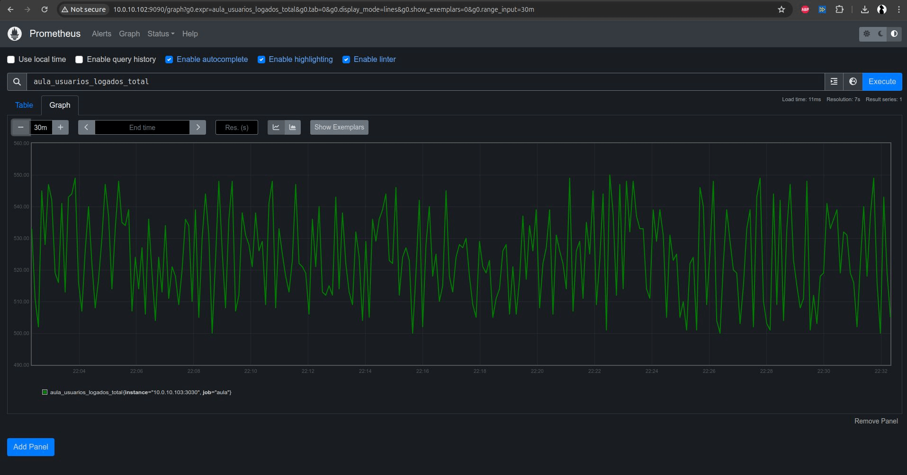

# Application monitoring with Prometheus and Grafana
For this class in the "Application Monitoring with Prometheus and Grafana" course, a simple application was developed in Node.js that randomly generates metrics to use Prometheus monitoring in real time.

For training I used prometheus on docker.

In the end, I took the opportunity to test the operation of Zabbix running directly from Docker as well and monitoring the infrastructure part.

<hr>

Create a node application with the command using the default settings, install express and use the /node-app/index.js file for the application, then start the application by preparing the index.js file:

```bash
$ npm init

$ npm install --save express

$ node node-app/index.js
```

Now run a container with Prometheus using the prometheus/prometheus.yml configuration file:

```bash
$ docker run --name prometheus -d -p 9090:9090 -v ./prometheus/prometheus.yml:/etc/prometheus/prometheus.yml prom/prometheus
```
To finish, upload a container with grafana to visualize the metrics:

```bash
$ docker run --name grafana -d -p 3000:3000 grafana/grafana
```

As optional, the following settings for zabbix were used:

```bash
$ docker network create --subnet 172.20.0.0/16 --ip-range 172.20.240.0/20 zabbix-net

$ docker run --name mysql -t -e MYSQL_DATABASE="zabbix" -e MYSQL_USER="zabbix" -e MYSQL_PASSWORD="passw0rd" -e MYSQL_ROOT_PASSWORD="passw0rd" --network=zabbix-net --restart unless-stopped -d mysql:8.0-oracle --character-set-server=utf8 --collation-server=utf8_bin --default-authentication-plugin=mysql_native_password

$ docker run --name zabbix-server-mysql -t -e DB_SERVER_HOST="mysql" -e MYSQL_DATABASE="zabbix" -e MYSQL_USER="zabbix" -e MYSQL_PASSWORD="passw0rd" -e MYSQL_ROOT_PASSWORD="passw0rd" --network=zabbix-net -p 10051:10051 --restart unless-stopped -d zabbix/zabbix-server-mysql:ol-6.4-latest

$ docker run --name zabbix-web-nginx-mysql -t -e ZBX_SERVER_HOST="zabbix-server-mysql" -e DB_SERVER_HOST="mysql" -e MYSQL_DATABASE="zabbix" -e MYSQL_USER="zabbix" -e MYSQL_PASSWORD="passw0rd" -e MYSQL_ROOT_PASSWORD="passw0rd" --network=zabbix-net -p 80:8080 --restart unless-stopped -d zabbix/zabbix-web-nginx-mysql:ol-6.4-latest
```

## Images

<h1 align="center">
    
</h1>
<h1 align="center">
    
</h1>
<h1 align="center">
    
</h1>
<h1 align="center">
    
</h1>
<h1 align="center">
    
</h1>

<hr>

Jean Rodrigo
